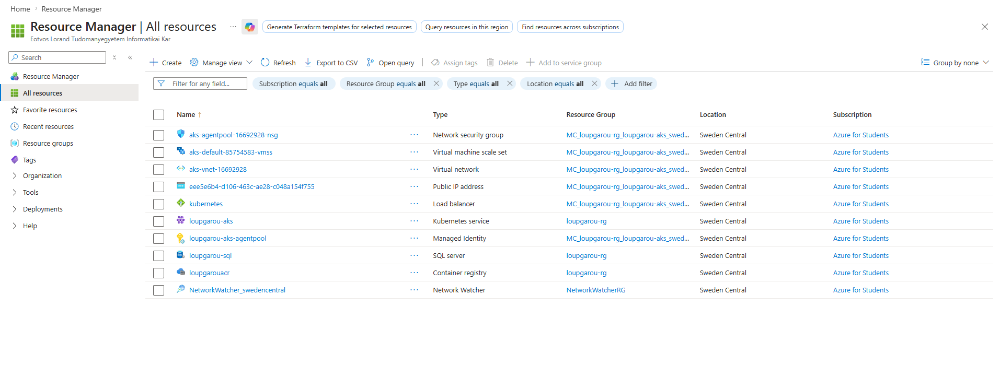

# LoupGarou Infra

Infrastructure for the LoupGarou app — Docker orchestration, Kubernetes manifests, and cloud provisioning via Terraform on Azure.


## Architecture

| Component | Technology | Azure Service |
|---|---|---|
| React frontend | Kubernetes pod | AKS |
| ASP.NET Core API | Kubernetes pod | AKS |
| Database | DBaaS | Azure SQL (Basic) |
| Container registry | — | ACR |

All infrastructure is provisioned with a single command: `terraform apply`

## Repositories

| Repo | Description |
|---|---|
| [LoupGarouAPI](https://github.com/BenAyedMehdi/LoupGarouAPI) | ASP.NET Core backend |
| [LoupGarouReact](https://github.com/BenAyedMehdi/LoupGarouReact) | React frontend |
| [LoupGarouInfra](https://github.com/BenAyedMehdi/LoupGarouInfra) | This repo — all infra lives here |

## Folder structure

```
LoupGarouInfra/
├── docker-compose.yml        ← local full-stack setup (all 3 services)
├── infra/                    ← Terraform — provisions Azure infrastructure
│   ├── main.tf               ← all Azure resources defined here
│   ├── variables.tf          ← input variables
│   ├── outputs.tf            ← ACR URL, AKS config, SQL endpoint
│   └── terraform.tfvars      ← your actual values (gitignored — never commit)
├── k8s/                      ← Kubernetes manifests
│   ├── api-deployment.yaml
│   ├── react-deployment.yaml
│  
└── .github/
    └── workflows/
        └── ci.yml        ← CI pipeline
        └── cd.yml        ← CD pipeline
```

---

## Local setup — full stack with Docker

### Prerequisites

- [Docker Desktop](https://www.docker.com/products/docker-desktop/) installed and running
- All three repos cloned side by side in the same parent folder:

```
projects/
├── LoupGarouAPI/
├── LoupGarouReact/
└── LoupGarouInfra/     ← this repo
```

### Run

```bash
docker compose up --build
```

| Service | URL |
|---|---|
| Frontend | `http://localhost:3000` |
| API + Swagger | `http://localhost:8080` |

Database migrations and card seeding run automatically when the API starts. No manual setup needed.

### Stop

```bash
docker compose down
```

Full reset including all database data:

```bash
docker compose down -v
```

---

## Cloud setup — Azure via Terraform

All Azure infrastructure is defined as code in the `infra/` folder and provisioned with a single Terraform command.

### Architecture provisioned

| Resource | Azure Service | Purpose |
|---|---|---|
| Resource Group | `loupgarou-rg` | Container for all resources |
| Container Registry | ACR — `loupgarouacr.azurecr.io` | Stores Docker images |
| Kubernetes Cluster | AKS — `loupgarou-aks` | Runs API and React pods |
| SQL Server | Azure SQL — `loupgarou-sql` | Managed database server |
| SQL Database | Azure SQL Basic | `LoupGarou` database |
| Firewall rule | — | Allows Azure services to reach SQL |
| Role assignment | AcrPull | Allows AKS to pull images from ACR |


---

### Prerequisites

- [Terraform](https://developer.hashicorp.com/terraform/install) installed and on PATH
- [Azure CLI](https://learn.microsoft.com/en-us/cli/azure/install-azure-cli) installed and logged in:

```bash
az login
```

- [kubectl](https://kubernetes.io/docs/tasks/tools/) installed

---

### First time setup

Create `infra/terraform.tfvars` with your values — this file is gitignored and must never be committed:

```hcl
subscription_id     = "your-azure-subscription-id"
location            = "swedencentral"
resource_group_name = "loupgarou-rg"
acr_name            = "loupgarouacr"
aks_name            = "loupgarou-aks"
sql_server_name     = "loupgarou-sql"
sql_admin_login     = "loupgarouadmin"
sql_admin_password  = "YourStrongPassword@2024!"
sql_database_name   = "LoupGarou"
```

---

### Provision all infrastructure — one command

```bash
cd infra
terraform init      # first time only — downloads Azure provider
terraform plan      # dry run — shows what will be created
terraform apply     # provisions everything on Azure (~5–10 minutes)
```

Once complete, Terraform outputs:

```
acr_login_server = "loupgarouacr.azurecr.io"
sql_server_fqdn  = "loupgarou-sql.database.windows.net"

```



---

### Connect kubectl to AKS

```bash
az aks get-credentials --resource-group loupgarou-rg --name loupgarou-aks
kubectl get nodes    # verify node is Ready
```

---

### Push Docker images to ACR

```bash
az acr login --name loupgarouacr

docker build -t loupgarouacr.azurecr.io/api:latest ../LoupGarouAPI
docker build -t loupgarouacr.azurecr.io/react:latest ../LoupGarouReact

docker push loupgarouacr.azurecr.io/api:latest
docker push loupgarouacr.azurecr.io/react:latest
```

---

### Deploy to AKS

```bash
kubectl apply -f k8s/
kubectl get services    # wait ~2 minutes for EXTERNAL-IP to appear on react service
```

Once the `react` service has an external IP, the app is live and accessible from any browser.

---

### Tear down

```bash
terraform destroy
```

Removes all provisioned Azure resources. Run this when not demoing to preserve student credits.

---

## Challenges and solutions

### Region restrictions — Azure for Students

Azure for Students subscriptions are locked to specific regions by a university-managed policy (`sys.regionrestriction`). Not all Azure regions or VM sizes are available.

To find your allowed regions:

```bash
az policy assignment list --scope /subscriptions/<your-subscription-id> --output table
```

Then check the policy assignment details in the Azure portal under **Policy → Assignments → Allowed resource deployment regions → Parameters**.

In our case the allowed regions were: `francecentral`, `germanywestcentral`, `polandcentral`, `swedencentral`, `spaincentral`. We chose `swedencentral`.

### VM size restrictions

Even within allowed regions, certain VM sizes are blocked for AKS. `Standard_B2s` (the most common small AKS node) was not available. To find available VM sizes for AKS in your region:

```bash
az aks get-versions --location <your-region> --output table
az vm list-usage --location <your-region> --output table
```

We used `Standard_B2as_v2` (2 vCPUs, Basv2 family) which was available and within the 6 vCPU regional quota of the student subscription.

### OIDC issuer conflict

During iterative Terraform applies across regions, the AKS cluster had `oidc_issuer_enabled` set to `true` by Azure automatically. Once enabled, it cannot be disabled. The fix is to explicitly set it in `main.tf`:

```hcl
oidc_issuer_enabled       = true
workload_identity_enabled = false
```

### SQL Server name must be globally unique

Azure SQL Server names are globally unique across all Azure customers. If a name was used in a previous failed attempt it may be soft-deleted and reserved for a period. Use a unique name in `terraform.tfvars` if you hit a conflict.

### Azure SQL Basic tier — transient connection failures

The Azure SQL Basic tier provides only 5 DTUs (Database Throughput Units). Under normal application load this causes intermittent connection drops with error `40613: Database is not currently available`.

The symptom is a `500 Internal Server Error` from the API even though migrations ran successfully and the app started cleanly.

The fix is enabling EF Core's built-in retry logic in `Program.cs`:

```csharp
builder.Services.AddDbContext<LoupGarouDbContext>(
    o => o.UseSqlServer(
        builder.Configuration.GetConnectionString("SqlServer"),
        sqlOptions => sqlOptions.EnableRetryOnFailure(
            maxRetryCount: 5,
            maxRetryDelay: TimeSpan.FromSeconds(30),
            errorNumbersToAdd: null
        )
    )
);
```

This tells EF Core to automatically retry failed connections up to 5 times before giving up — which is exactly what Azure SQL recommends for the Basic tier.

---

## Live application

The application is deployed and accessible at:

| Service | URL |
|---|---|
| Frontend | http://135.116.213.70 |
| API + Swagger | http://135.116.213.70/api (proxied via nginx) |

The full deployment flow on AKS:
- React frontend served by nginx on port 80
- nginx proxies `/api/*` requests internally to the API pod on port 8080
- API connects to Azure SQL — migrations and seeding run automatically on startup
- No manual database setup required

---

## What's next — CI/CD pipeline

The remaining step is automating the build and deploy flow via GitHub Actions. The goal is:

```
push to main → GitHub Actions triggers
  → build API image → push to ACR
  → build React image → push to ACR
  → kubectl rollout restart → new version live on AKS
```

This is implemented in `.github/workflows/ci.yml` and `.github/workflows/cd.yml`.

---

## CI/CD pipeline

The GitHub Actions pipeline in `.github/workflows/deploy.yml` triggers automatically on every push to `main`:

1. Checks out both app repos
2. Builds the API and React Docker images
3. Pushes both images to ACR
4. Applies the K8s manifests to AKS — new version live automatically

No manual deployment steps required after merging to `main`.

---





